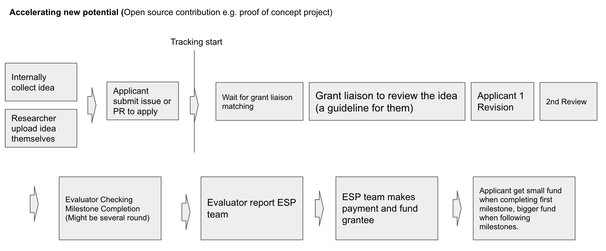

# Purpose

The purpose of this grant program is to help enable the potential of those who recently started their journey in the world of ZKP/FHE/lookup/etc. Specifically, our goal is to:

1. **Lower the entry barrier for ZKP/FHE/lookup/etc research**

    For many people, it is not clear how to get started with ZKP research, and we want this program to be a menu of options for those interested in going deeper. We aim for this program to encourage people in the community to take on the challenge of attaining a deeper understanding of ZKP/FHE/lookup/etc.

2. **Encourage domain expertise development**

    Many people go through a ZKP/FHE/lookup/etc-focused course or program (e.g. zkPlayground or PSE Summer Contribution Program) and may not have the resources to continue their learning in a specific direction after the program ends.

    With this program, we would like to support them to continue building deeper knowledge and skills into more specific areas of research and eventually become a domain expert.

## Program Summary

Ideas for grants are submitted as Open Task into a Github repository by Barry or PSE Team leads. Potential applicant will then submit proposals to be evaluated by “Grant Liaisons”. A grant liaison will not only evaluating the initial proposal, but will also be supervising milestone completion, approving disbursement of funds, ongoing tracking/advising and general oversight of an awarded grant.

## How to Get Started

1. See the [Open Task List](../Open-Task/Open-Task-List.md)
2. Apply on GitHub through sending issue and follow the template.
3. Wait for grant liaison pick up the application and review
4. Submit and update your deliverable in the dedicated form on every milestones
5. Request for review by grant liaison.
6. Get funding at every milestone completion.
7. Shall you have any question, send the issue on GitHub

## Application Life Cycle

The diagram above illustrates the general life cycle of a program application from the formation of an idea as an Open Task all the way to the execution of an initial milestone. Some of these details are clarified further here:

1. **Idea Sourcing and Open Task**
    1. Barry and PSE research team member can add their ideas directly to this [Open Task List](./Open-Task-List.md)
    2. The format of these Open Task is yet to be determined, but there are industry standard templates that EcoDev will build on top of. We will draft an Open Task template based on feedback from the wider PSE team.
2. **Applicant Selection**
    1. Applicants will be solicited to evaluate the list of available Open Task and submit their proposal along with relevant milestones as an issue or PR to the [repo](https://github.com/NOOMA-42/sample-pse-small-grant).
    2. Applicants may refer to [application guidelines](#how-to-get-started).
    3. In the case where multiple applicants are interested in the same Open Task, we shall consider one of the following options:
        1. Evaluate them at the same time (i.e. round-style with a deadline for submission).
        2. Evaluate them on a first-come first-serve basis.
        3. Other. We might have to consider these proposals on a case-by-case basis.
            1. If all the applicants meet the criteria, we might consider grant multiple applicants.
3. **Grant Liaison Matching**
    1. Internally we maintain an grant liaison availability list and their domain expertise along side of their names. EcoDev will work with leadership and project leads to determine the appropriate candidate to be an evaluator.
4. **Milestone Completion and Funding**
    1. Grantee will receive a small amount of funding after the completion of the first milestone.
    2. Following milestones will be awarded larger amounts.
    3. Stale issues will be closed by grant liaison or a bot.

## Operational Platform

For the operation of this program, we will primarily utilize a Github repository for managing documents and staging of the grant proposals, grantees, and their progress. Stakeholders involved can utilize Github issues and pull requests to comment and collaborate.

## Selection Criteria

## FAQs
